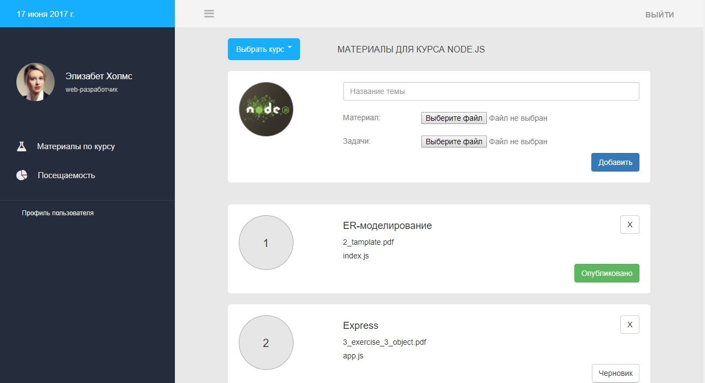
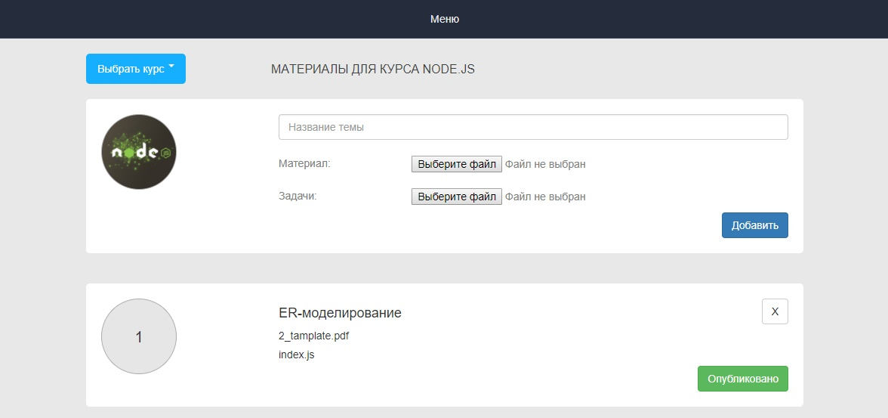

## Приложение для добавления, удаления и просмотра материалов курсов.




1. Чтобы запустить приложение, создайте базу данных, таблицу и заполните её из файла init.sql для отображения данных.

2. Установите зависимости

```
npm install
```

3. Запуск сервера

```
node app.js
localhost:4000
```